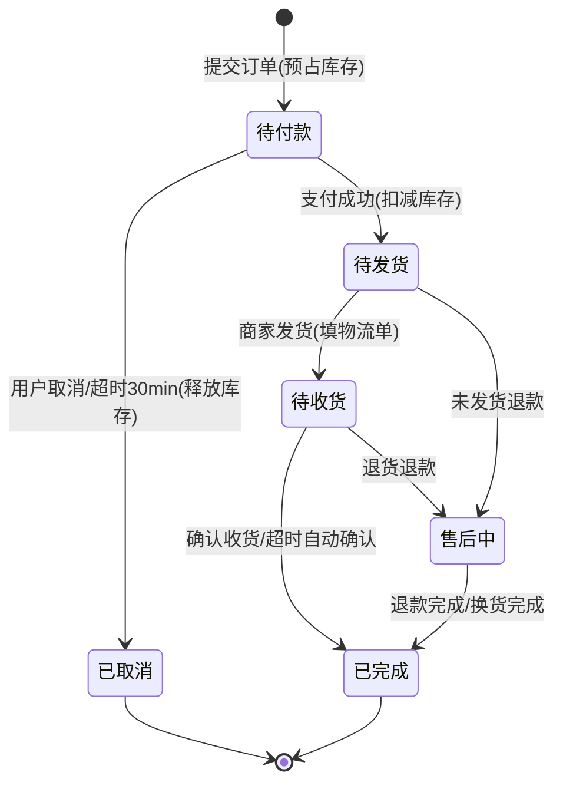
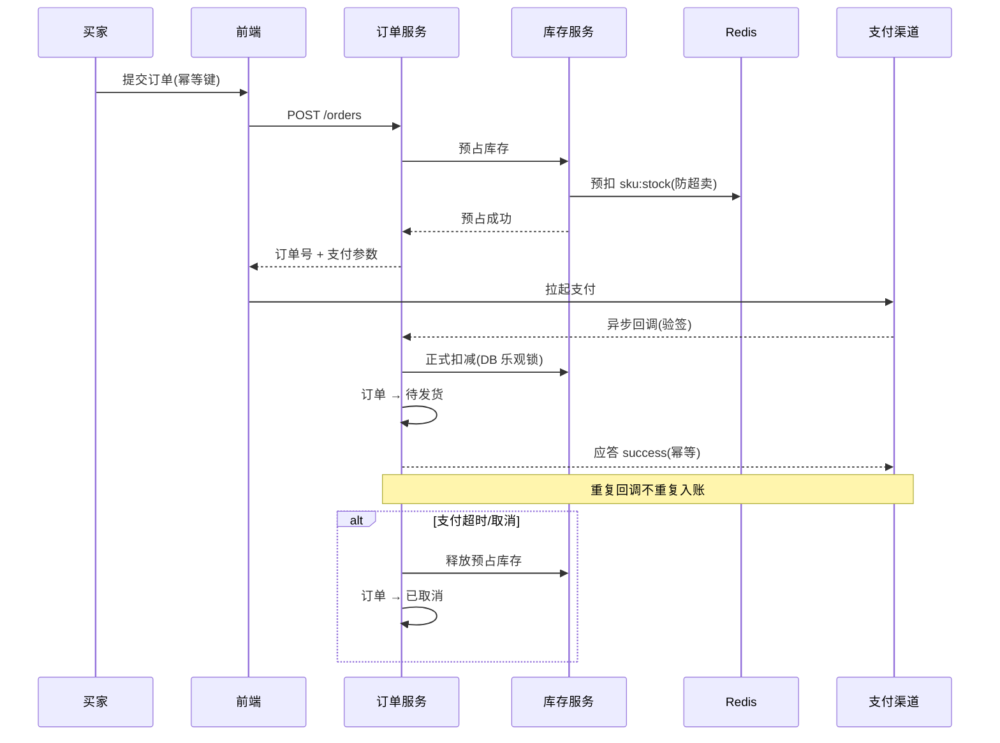

# 电商平台需求分析文档

> 版本:v1.0 ｜ 日期:2026-08-24 ｜ 状态:待评审
> 技术栈假设:[假设] Java 17 + Spring Cloud Alibaba 微服务 + Vue3(PC)/uni-app(移动端) + MySQL 8.0 分库分表 + Redis + Elasticsearch + RocketMQ + 对象存储(OSS) + K8s 部署
> 配套文档:[现有实现 vs 需求差距分析](REQUIREMENTS-GAP.md)· [开发路线图](ROADMAP.md)

## 1. 项目概述

### 1.1 项目背景
电商行业竞争激烈,当前自营/平台型商家对"商品-交易-履约"完整闭环的数字化需求明确。项目从零搭建一个平台型电商系统,核心是让买家能完成"浏览 → 加购 → 下单 → 支付 → 收货 → 评价"的完整链路,同时为商家/运营/客服提供可运营、可管理的后台工具。

### 1.2 项目目标
- **规模目标**:注册用户 100 万,日活(DAU)20 万,峰值在线 5 万;SPU 10 万、SKU 50 万。
- **交易目标**:日常日订单 10 万单,大促峰值 **1000 单/秒**、下单接口 **5000 QPS**。
- **体验目标**:首页首屏加载 < 2s,核心接口 P95 < 300ms,下单全链路(提交→支付成功回调) < 3s。
- **质量目标**:可用性 ≥ 99.95%(年不可用 < 4.4h),库存超卖 = 0,支付对账差错率 < 0.01%,支付成功率 ≥ 99.9%。

### 1.3 项目范围
**包含(MVP)**:商品展示与搜索、购物车、下单、支付(微信/支付宝/余额)、订单管理、库存管理、基础营销(优惠券/满减)、评价、售后(退款/退货)、后台管理(商品/订单/用户/营销/权限)、数据看板。

**不包含(本期不做)**:拼团/秒杀/直播带货、分销/合伙人体系、国际化与多币种、自建物流仓配、多租户 SaaS 模式、移动端 App 原生版本。

### 1.4 关键术语定义

| 术语 | 定义 |
|---|---|
| SPU | 标准产品单元,如"iPhone 15",决定商品属性 |
| SKU | 最小库存单元,如"iPhone 15 · 黑色 · 256G",决定价格与库存 |
| GMV | 拍下订单总金额(含未支付),用于运营统计 |
| 实付金额 | 扣除优惠券/满减后买家实际支付金额 |
| 预占库存 | 下单未支付时临时占用库存,支付超时后释放 |
| 库存水位/安全库存 | 触发采购/预警的库存阈值,默认设置 100 [假设] |
| 对账 | 平台账单与第三方支付渠道账单的逐笔核对 |

---

## 2. 用户角色与权限

### 2.1 角色定义

| 角色 | 说明 |
|---|---|
| 游客 | 未登录,可浏览/搜索/查看详情,不可下单 |
| 买家(注册用户) | 核心用户,可购物/下单/支付/评价/售后 |
| 商家 | 可管理自家店铺的商品、订单、发货、评价回复 |
| 平台管理员 | 系统级管理:商品审核、用户管理、权限配置 |
| 运营人员 | 营销活动配置、数据看板查看、类目管理 |
| 客服 | 处理售后退款/退货工单、用户投诉 |

### 2.2 功能权限矩阵

| 功能 | 游客 | 买家 | 商家 | 运营 | 客服 | 管理员 |
|---|:-:|:-:|:-:|:-:|:-:|:-:|
| 商品浏览/搜索/详情 | ✅ | ✅ | ✅ | ✅ | ✅ | ✅ |
| 加入购物车/下单/支付 | — | ✅ | — | — | — | — |
| 个人中心/地址/评价 | — | ✅ | — | — | — | — |
| 商品发布/编辑/上下架 | — | — | ✅(本店) | — | — | ✅ |
| 发货/物流单号填写 | — | — | ✅(本店) | — | — | ✅ |
| 营销活动配置 | — | — | — | ✅ | — | ✅ |
| 售后退款审批 | — | — | 部分(本店) | — | ✅ | ✅ |
| 商品/内容审核 | — | — | — | ✅ | — | ✅ |
| 用户/商家管理 | — | — | — | — | — | ✅ |
| 数据看板 | — | — | 本店 | ✅ | — | ✅ |
| 权限/角色管理 | — | — | — | — | — | ✅ |

---

## 3. 功能需求

### 3.1 商品管理

**用户故事**:作为买家,我能按分类/关键词/属性筛选商品,并能从详情页快速判断是否有货、价格多少,以便决策购买。

| 功能点 | 需求描述 | 优先级 |
|---|---|:-:|
| 商品分类 | 三级类目,支持类目树管理,分类下可挂商品 | P0 |
| 商品属性 | 全局属性(品牌)+ 类目属性(规格:颜色/尺寸),属性可检索 | P0 |
| SPU/SKU | 1 SPU 对 N SKU;SKU 决定价格/库存/图片 | P0 |
| 上下架 | 商家可上下架;敏感商品需运营审核后才可上架 | P0 |
| 库存 | SKU 级库存,支持多仓库存分配(二期) | P0 |
| 价格 | 销售价/划线价/活动价;价格变更需留痕 | P0 |
| 搜索筛选 | ES 全文检索;支持关键词、价格区间、品牌、销量排序、筛选聚合 | P0 |
| 商品详情 | 图文详情、规格选择、库存/价格实时展示、销量、评价摘要 | P0 |

**验收标准**:搜索响应 P95 < 300ms;商品上下架/价格变更 **5 秒内**同步到搜索与缓存。

### 3.2 用户管理

| 功能点 | 需求描述 | 优先级 |
|---|---|:-:|
| 注册/登录 | 手机号+验证码、邮箱+密码、微信/支付宝第三方授权登录 | P0 |
| 账号安全 | 修改密码、绑定/解绑手机、登录设备管理、异常登录提醒 | P1 |
| 个人信息 | 头像、昵称、性别、生日维护 | P1 |
| 收货地址 | 地址 CRUD,默认地址,省市区三级联动 | P0 |

**验收标准**:登录注册接口在 5000 QPS 并发下不崩溃;验证码接口频控:同一手机号 60s 内最多 1 条、单日 ≤ 10 条。

### 3.3 购物车

| 功能点 | 需求描述 | 优先级 |
|---|---|:-:|
| 加入购物车 | 游客本地购物车,登录后合并 | P0 |
| 增删改 | 数量增减、删除、全选/单选 | P0 |
| 选中结算 | 仅对勾选商品发起结算 | P0 |
| 价格计算 | 按最新价实时刷新,含促销价 | P0 |
| 失效处理 | 已下架/缺货商品置灰并标注原因,不自动删除 | P1 |

**验收标准**:购物车数量变更后接口 P95 < 200ms;价格以结算时服务端计算为准,前端展示仅参考。

### 3.4 订单管理

**状态机**(详见 §4.4):待付款 → 待发货 → 待收货 → 已完成;旁路:已取消、售后中(退款/退货)。

| 功能点 | 需求描述 | 优先级 |
|---|---|:-:|
| 订单生成 | 提交订单即生成订单号(雪花算法),记录商品快照、收货信息、金额明细 | P0 |
| 状态流转 | 严格按状态机流转,禁止跳转;超时自动取消(默认 30 分钟 [假设]) | P0 |
| 订单拆分 | 多店铺订单按店铺拆分,一个父单拆多子单 | P0 |
| 取消/退款 | 待付款可主动取消;支付后退款走售后流程 | P0 |
| 金额组成 | 商品金额 + 运费 - 优惠 - 积分抵扣 = 实付金额 | P0 |

**验收标准**:下单接口在 1000 单/秒下成功率 ≥ 99.99%,订单号全局唯一;重复提交不产生重复订单(幂等键防重)。

### 3.5 支付

| 功能点 | 需求描述 | 优先级 |
|---|---|:-:|
| 支付方式 | 微信支付、支付宝、平台余额 | P0 |
| 支付流程 | 下单→发起支付→渠道返回→异步回调→订单改状态 | P0 |
| 支付回调 | 回调必须幂等,重复通知不重复入账;支持回调失败重试(24h 内最多 20 次) | P0 |
| 支付超时 | 待付款订单 30 分钟未支付自动取消并释放库存 | P0 |
| 对账 | 每日与微信/支付宝对账单核对,差错自动告警 | P1 |

**验收标准**:支付回调处理 P95 < 200ms,幂等保证 0 重复入账;日终对账差异单自动生成工单。

### 3.6 库存管理

| 功能点 | 需求描述 | 优先级 |
|---|---|:-:|
| 预占 | 下单(待付款)即预占库存,防超卖 | P0 |
| 扣减 | 支付成功后正式扣减 | P0 |
| 回补 | 订单取消/退款成功后回补库存 | P0 |
| 超卖防护 | Redis 预扣 + 数据库乐观锁,超卖率 = 0 | P0 |
| 库存预警 | 低于安全库存(默认 100)触发预警,通知商家/运营 | P1 |

**流程**(见 §4.3):下单预占 → 支付扣减 → 取消/退款回补,全程异步消息保证最终一致。

### 3.7 物流配送

| 功能点 | 需求描述 | 优先级 |
|---|---|:-:|
| 运费模板 | 按地区/重量/件数配置运费,包邮门槛 | P1 |
| 发货 | 商家填写快递单号,订单转"待收货" | P0 |
| 物流跟踪 | 对接快递鸟/快递100,实时轨迹展示 | P1 |
| 收货确认 | 买家确认收货或超时自动确认(默认发货后 15 天) | P0 |

### 3.8 营销促销

| 功能点 | 需求描述 | 优先级 |
|---|---|:-:|
| 优惠券 | 平台券/店铺券,满减券/折扣券;领取、核销、过期处理 | P0 |
| 满减 | 平台满 X 减 Y,可叠加店铺券(规则可配置) | P1 |
| 积分 | 消费返积分,积分抵扣 | P2 |
| 会员等级 | 按累计消费分等级,不同折扣/权益 | P2 |
| 秒杀/拼团 | [假设] 本期不做,架构预留活动扩展点 | P3 |

**验收标准**:优惠计算服务端统一核算,前端金额展示与服务端一致;同用户同券只能使用一次。

### 3.9 评价管理

| 功能点 | 需求描述 | 优先级 |
|---|---|:-:|
| 发布评价 | 确认收货后可评价,默认评分 1-5 星 | P0 |
| 晒图 | 支持上传图片(≤ 9 张,单张 ≤ 5MB) | P1 |
| 追评 | 首次评价后 30 天内可追评一次 | P2 |
| 商家回复 | 商家可对评价回复一次 | P1 |

### 3.10 售后服务

| 功能点 | 需求描述 | 优先级 |
|---|---|:-:|
| 退款申请 | 未发货直接退款;已发货走退货退款 | P0 |
| 退货流程 | 申请→商家同意→买家寄回→商家确认收货→退款 | P1 |
| 换货 | 同 SKU 换货,需有货 | P2 |
| 工单处理 | 客服介入超时未处理的工单(默认 48h 未处理自动升级) | P1 |
| 退款到账 | 原路退回,余额退回余额;退款时效:审核通过后 1-3 个工作日 [假设] | P0 |

### 3.11 后台管理

| 功能点 | 需求描述 | 优先级 |
|---|---|:-:|
| 数据看板 | 今日 GMV/订单量/新增用户/转化率,实时刷新(≤ 1min 延迟) | P0 |
| 商品审核 | 商品上架审批、违规下架、类目迁移 | P0 |
| 订单处理 | 订单查询/备注/强制关闭、异常单处理 | P0 |
| 用户管理 | 用户查询、封禁/解封、风险用户标记 | P1 |
| 营销配置 | 优惠券/满减/活动配置与生效管理 | P0 |
| 权限管理 | RBAC 角色-权限分配,操作审计日志 | P0 |

### 3.12 数据统计

| 指标 | 定义 | 口径 |
|---|---|:-:|
| GMV | 拍下订单金额(含未支付) | 实时看板 + 日终归档 |
| 订单量 | 成功支付订单数 | 按天/按小时 |
| 转化率 | 支付订单数 / 独立访客(UV) | 漏斗:浏览→加购→下单→支付 |
| 用户增长 | 新增注册/新增活跃 | 日/周/月 |
| 商品分析 | 销量 TOP100、库存周转、滞销品 | 周报 |

---

## 4. 关键业务流程

### 4.1 用户下单支付流程(含异常)

```
加购/直接购买 → 确认订单(地址+优惠+运费) → 提交订单
      ├─ 校验: 商品在售、库存充足、金额一致、地址合法
      ├─ 失败 → 提示原因,不扣库存,回购物车
      └─ 成功 → 预占库存 → 生成待付款订单(30min) → 发起支付
             ├─ 支付成功(回调) → 扣库存 → 通知商家发货
             ├─ 支付失败/取消 → 订单取消 → 释放预占库存
             └─ 超时未支付 → 系统自动取消 → 释放库存
```

**异常流程**:库存不足(提示缺货/拦截)、重复支付回调(幂等)、支付成功但扣库存失败(消息重试+人工工单)、金额不一致(拒绝并告警)。

### 4.2 退款/退货流程

```
买家申请退款/退货
  ├─ 未发货 → 直接退款 → 原路退回 → 订单完结
  └─ 已发货 → 退货退款: 商家同意 → 买家寄回 → 商家确认收货
             ├─ 商家同意 → 退款
             └─ 商家拒绝 → 客服介入工单(48h 未处理自动升级)
```

### 4.3 库存扣减与回补流程

```
下单预占(Redis 预扣) ──支付成功──▶ 正式扣减(DB 乐观锁) ──▶ 更新销量
      │
      └──取消/超时/退款──▶ 回补预占/已扣库存(RocketMQ 异步)
```

一致性:预占用 Redis 防并发超卖,正式扣减用 DB 行锁/乐观锁兜底,消息队列保证最终一致。

### 4.4 订单状态流转图



---

## 5. 非功能需求

### 5.1 性能

| 指标 | 目标值 |
|---|---|
| 首页/商品详情首屏 | < 2s(弱网 < 4s) |
| 核心接口响应 P95 | < 300ms |
| 下单接口 | 支持 1000 单/秒,成功 ≥ 99.99% |
| 搜索接口 | 5000 QPS,P95 < 300ms |
| 缓存命中率 | 商品详情/类目 ≥ 95% |
| 高峰 QPS 弹性 | 支持 3 倍日常峰值的自动扩容 |

### 5.2 安全

| 项 | 要求 |
|---|---|
| 数据传输 | HTTPS 全站;支付敏感数据不经前端 |
| 数据加密 | 密码 bcrypt 存储;手机号/身份证加密存储(可脱敏展示) |
| 支付安全 | 支付渠道签名校验、回调验签、金额/订单号校验 |
| 防刷 | 登录/短信/下单接口限流(Redis 计数 + Sentinel);验证码图形/滑块 |
| 权限控制 | RBAC + 接口级鉴权,操作审计日志留痕 ≥ 180 天 |
| 注入防护 | SQL 注入/越权(IDOR)/水平越权防护,上线前安全扫描 |

### 5.3 可用性

| 指标 | 目标 |
|---|---|
| 系统可用性 | ≥ 99.95%(年宕机 < 4.4h) |
| 核心链路(下单/支付) | ≥ 99.99% |
| 容灾 | 双可用区部署,核心服务无单点;数据库主从+定期备份 |
| 备份 | 数据库每日全量 + 每 30min binlog 增量;备份保留 30 天 |
| 降级 | 大促时搜索可降级为 DB 检索,评价/日志可异步削峰 |

### 5.4 兼容性

- **PC 浏览器**:Chrome/Edge/Firefox/Safari 最新两个大版本。
- **移动端**:H5 适配主流机型;小程序/App 二期。
- **分辨率**:PC ≥ 1280px;移动端 320px 起自适应。

### 5.5 可扩展性

- **架构**:微服务拆分(商品/订单/支付/库存/用户/营销/售后/搜索/后台),服务可独立水平扩展。
- **水平扩展**:无状态服务支持 K8s 自动扩缩容;按"商品/订单"分片扩展。
- **解耦**:下单/支付/库存走 MQ 异步,支持流量削峰;营销活动通过 SPI/策略扩展点接入。

---

## 6. 数据需求

### 6.1 核心实体与关键字段

| 实体 | 关键字段 | 说明 |
|---|---|---|
| 用户 user | id, phone, email, password_hash, nickname, status, created_at | 加密存储,手机唯一 |
| 收货地址 address | id, user_id, receiver, phone, province/city/district, detail, is_default | |
| 商品 SPU | id, name, category_id, brand_id, status(上架/下架/审核中) | |
| 商品 SKU | id, spu_id, spec_value(如 黑/256G), price, original_price, stock, sales | 价格与库存挂 SKU |
| 购物车 cart_item | id, user_id, sku_id, quantity, checked | |
| 订单 order | id(雪花), user_id, order_no, total_amount, pay_amount, freight, discount, status, create_time | 父子单:parent_order_no |
| 订单明细 order_item | id, order_id, sku_id, product_name, price, quantity, snapshot | 商品快照防改价 |
| 支付单 payment | id, order_no, pay_channel, transaction_no(渠道单号), amount, status, paid_time | 渠道单号唯一 |
| 库存 stock | sku_id, available, locked, sold;预占/扣减流水 | 乐观锁版本号 |
| 优惠券 coupon/user_coupon | coupon_id, user_id, threshold, discount, status, expire_time | 一人一券唯一约束 |
| 评价 review | id, order_item_id, sku_id, user_id, score, content, imgs, reply | |
| 售后 return_request | id, order_no, type(仅退款/退货), reason, status, refund_amount | |
| 操作审计 audit_log | id, operator_id, action, target, detail, time | 保留 180 天 |

### 6.2 数据关系简要说明

```
用户 1─N 地址/订单/评价/优惠券
SPU 1─N SKU;类目 1─N SPU
订单 1─N 订单明细;明细 1─N SKU(快照)
订单 1─1 支付单;订单 0─1 售后单
SKU 1─1 库存
```

[假设] 用户、订单按 ID 取模分库分表(如 4 库 16 表,按量动态评估);商品/库存走缓存 + 数据库双写。

---

## 7. 接口需求

### 7.1 第三方接口

| 接口 | 用途 | 要求 |
|---|---|---|
| 微信支付/支付宝 | 统一下单、支付回调、退款、对账单 | 回调验签、幂等、重试机制 |
| 快递鸟/快递100 | 运费查询、物流轨迹 | 轮询+主动推送 |
| 短信平台(阿里云/腾讯云) | 验证码、通知 | 频控、模板审核 |
| 实名认证(公安三要素) | 高价值商品/商家认证 [假设] | 合规留痕 |
| 地图(高德/腾讯) | 省市区三级、地址解析 | 服务端缓存区划 |

### 7.2 内部接口规范

- **前后端**:RESTful + JSON,统一响应 `{ code, msg, data }`;统一鉴权 header(`token`);分页统一 `{ list, total }`;错误码分段(1xxx 参数、2xxx 业务、9xxx 系统)。
- **服务间**:内部走 RPC(OpenFeign),服务调用超时 3s、重试 2 次、熔断降级;异步消息走 RocketMQ(事务消息保证下单-扣库存最终一致)。
- **接口文档**:OpenAPI(Swagger)在线维护,前后端联调以契约为准。

---

## 8. 风险与约束

### 8.1 技术风险

| 风险 | 影响 | 应对 |
|---|---|---|
| 大促瞬时流量 | 下单/支付链路雪崩 | 限流+削峰(消息队列)+降级预案+压测 |
| 分布式事务 | 库存与订单不一致 | 事务消息+对账+补偿,不追求强一致 |
| 分库分表后跨库查询 | 报表/统计困难 | 数仓/ES 聚合,业务查询按分片键 |
| 数据迁移 | 上线后扩容成本高 | 上线前预估容量,预留分片 |

### 8.2 业务风险

- **超卖/虚假库存**:通过预占+乐观锁+对账三重保障。
- **改价纠纷**:订单快照+价格留痕+金额服务端核算。
- **恶意退款/薅羊毛**:风控规则(同设备/同 IP 频控、黑名单、人工审核)。

### 8.3 合规风险

- **个人信息保护法(PIPL)**:最小化收集、加密存储、用户删除权(注销账号后 30 天内清理个人数据)、隐私政策。
- **电商法**:七天无理由退货、信息披露、商品质量责任。
- **支付新规**:资金清结算合规,沉淀资金需对接持牌机构 [假设];支付相关凭证留存 ≥ 5 年。

### 8.4 项目约束

| 约束 | 说明 |
|---|---|
| 周期 | 一期 MVP 研发 4~6 个月 [假设],预留 1 个月压测/联调 |
| 团队 | 后端 4~6 人、前端 2~3 人、测试 1~2 人、产品/运营各 1 人 [假设] |
| 技术栈 | 默认主流微服务架构(见文首) |
| 合规 | 上线前通过安全扫描与隐私合规评审 |

---

## 附录 A:关键用例描述

### UC-01 买家下单支付
- **参与者**:买家
- **前置条件**:已登录、购物车/直购有在售商品、有收货地址
- **基本流程**:
  1. 买家提交订单,系统校验商品在售、库存、金额、地址
  2. 系统预占库存,生成待付款订单(30min 有效),返回订单号与支付参数
  3. 买家拉起微信/支付宝支付
  4. 支付渠道异步回调,系统验签并幂等处理,扣减库存,订单转"待发货"
  5. 通知商家发货
- **备选流程**:
  - 库存不足 → 提示并拦截,不扣库存
  - 支付超时/取消 → 订单"已取消",释放预占库存
  - 支付成功但回调延迟 → 前端轮询订单状态兜底,24h 内重试回调
  - 金额不一致 → 拒绝支付并告警

### UC-02 退款/退货
- **参与者**:买家、商家、客服
- **基本流程**:
  1. 买家发起仅退款或退货退款申请
  2. 未发货 → 商家/系统同意 → 原路退款 → 订单完结
  3. 已发货 → 商家同意 → 买家寄回 → 商家确认收货 → 退款
  4. 退款成功后回补库存
- **备选流程**:商家拒绝 → 客服介入,48h 未处理自动升级。

### UC-03 商家发货
- **参与者**:商家
- **前置条件**:订单"待发货"
- **基本流程**:商家填快递单号 → 调用物流接口获取单号校验 → 订单转"待收货" → 通知买家。
- **备选流程**:快递单号无效 → 拦截提示。

## 附录 B:下单支付时序图


